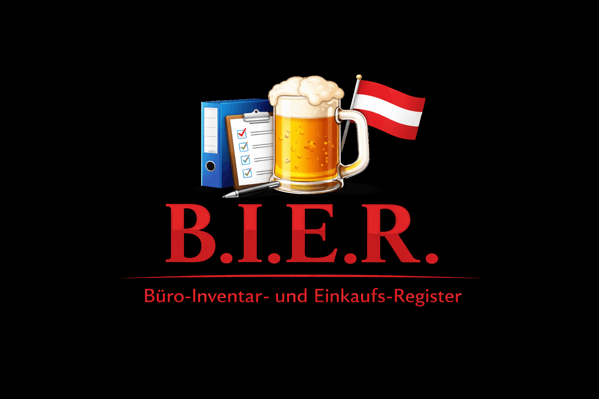

<p align="center">
  
</p>

# B.I.E.R - Büro-Inventar- und Einkaufs-Register

A warehouse management web application built with Python, Flask, MongoDB, and Docker.

---

## About

This project was developed as part of the Software Development and Project Management (SWP) course at TGM - Die Schule der Technik, Vienna, Austria (2026).

**Project Team:**

- Paul Hinterbauer
- Mateja Gvozdenac
- Dragoljub Mitrovic
- Emir Keser

---

## Features

- **Inventory Management** - Track and manage warehouse stock
- **Flask Web UI** - Browser-based interface for all operations
- **MongoDB Backend** - Persistent data storage
- **Port-Adapter Architecture** - Clean, testable, and maintainable codebase
- **Docker Support** - One-command deployment with Docker Compose

---

## Prerequisites

- **Python 3.10+**
- **Docker Desktop** - Required for containerized deployment

---

## Installation

### 1. Clone the Repository

```bash
git clone <repository-url>
cd B.I.E.R
```

### 2. Run with Docker

Start all services (Flask app, MongoDB, Mongo Express) with a single command:

```bash
docker compose up --build
```

### 3. Run Locally (without Docker)

```bash
# Create and activate a virtual environment
python -m venv .venv
.venv\Scripts\activate      # Windows
source .venv/bin/activate   # Linux/Mac

# Install dependencies
pip install -e .

# Run tests
pytest
```

---

## Usage

Once running, the following services are available:

| Service       | URL                                         | Description         |
| ------------- | ------------------------------------------- | ------------------- |
| Flask App     | [http://localhost:5000](http://localhost:5000) | Main web interface  |
| Mongo Express | [http://localhost:8081](http://localhost:8081) | Database management |

---

## Architecture

```
Frontend (Flask)
      |
  Backend (Logic)
      |
   DB (MongoDB)
```

- **Frontend** - Flask routes and Jinja2 templates (`src/bierapp/frontend/`)
- **Backend** - Business logic (`src/bierapp/backend/`)
- **DB** - MongoDB adapter (`src/bierapp/db/`)
- **Contracts** - Shared interfaces (`src/bierapp/contracts.py`)

---

## Testing

```bash
# Unit tests
pytest tests/unit/ -v

# Integration tests
pytest tests/integration/ -v

# With coverage
pytest --cov=src tests/
```

---

## License

This project is licensed under the MIT License - see the [LICENSE](LICENSE) file for details.
